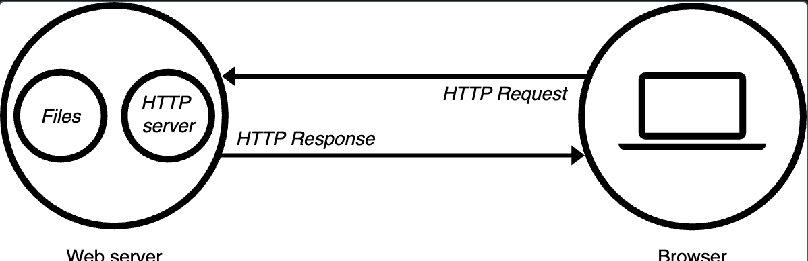

# Backend Development
- [Web Server](#what-is-a-web-server)
- [Server and Client-side Programming](#server-side-vs-client-side-programming)
- [Web Security](#web-security)

## What is a Web Server?
A web-server can refer to hardware or software, or both working toegther:
1. __Hardware__: A web-server can be a computer that stores software and a website's files like HTML documents, CSS stylesheets, JS files, and images. The web-server connects to the internet and supports the exchange of physical data with other devices connected to the internet.
2. __Software__: A web-server includes several parts that control how users access hosted files. Typically it is through a HTTP server, a software that understand `URLs`(web addresses) and `HTTP` (protocol browsers use). An HTTP server can be accessed through the domain names of the websites it stores, and it delivers the content of these hosted websites to the end user's device.

When a browser needs a file hosted on a webserver, it makes an HTTP request. When the request reaches the correct hardware web-server, the software HTTP web-server accepts the request and finds the requested files and sends it back to the browser through HTTP. If the file is not found, a `404` response is sent instead. 

To publish a website, one needs a static or dynamic web-server. A `static web-server` (stack) sends the hosted files "as-is" to the web-server, and it contains a computer (hardware) and an HTTP server (software). A `dynamic web-server` consists of a static web-server and additional software like an application server or database, where the application server updates the hosted files before sending content to the browser.

Files can be hosted on a personal computer but its better to use a dedicated web-server:
- Availability: It's up and running
- It's always connected to the internet, removing down-times
- It can have the same IP address all the time, known as a _dedicated IP address_.
- Maintained by a third-party

The web-server provides support for __Hypertext Transfer Protocol__ (HTTP), which specifies how to transfer hypertexts (linked web documents) between two computers. A __protocol__ is a set of rules for communicating between two computers and HTTP is a textual, stateless protocol:
- __Textual__: Plain-texts commands that are human-readable
- __Stateless__: The server nor the client remembers previous communication; but the application server does.

__Apache__ and __Nginx__ are open-source web-servers used for HTTP and proxy servers. They are often used as 7-layered load balancers at the application level. With benefits of:
- Load Balancing: Routes requests to different servers
- Security
- Caching: serve a resource on its own, saving time and network throughput
- Optimise Compression
- Handles SSL

To handle languages like PHP they use a process called __FastCGI Process Manager__ (FPM). __Apache__ is highly configurable (_.htaccess_) and extendible through a process architecture. It is commonly found in legacy systems but can still be used today, as its good with handling dynamic content. __NGINX__ is fast and operates through an event-driven asynchronous architecture and is suitable for containers, high-traffic sites, and cloud deployments.
## Server-side vs Client-side Programming
The main difference between server-side and client-side programming is where the codes executes. Server-side programming the code runs on the remote web-server before the client receives it. It generates the actual content of the web page, interacts with the database, handles business logic, authenticates users, and provides security. It offers benefits like:
- __Data Persistence__: The server-side is the only place to connect to a database (like MySQL or PostgreSQL). This allows the application to remember information—users, blog posts, product lists—between sessions.
- __Security and Logic__: Critical business logic (e.g., calculating prices, verifying login credentials, managing API keys) is kept hidden from the user, protecting it from tampering.
- __Dynamic Content Generation__: Creates content on the fly.
- __Personalisation__: It allows you to generate unique content for each user. For example, showing a specific user's dashboard, shopping cart, or a personalized greeting ("Welcome back, [User Name]!").
- __Platform Independent__: The server determines the final HTML output. It doesn't matter what browser (Chrome, Firefox, Safari) the user is on; they all receive the same, standards-compliant content.
- __Resource Management__: It efficiently handles system resources, file uploads, sending emails, and connecting to external services.
- __Integration with other Services__: Can communicate with several APIs.

__Client-side programming__ is where the code runs on the user's browser through languages like HTML, CSS, and JS. Users can view the code in the inspection section of browsers. It is used for displaying content, interacting with the user, basic form validation, rendering UI components, and animations.

## Web Security