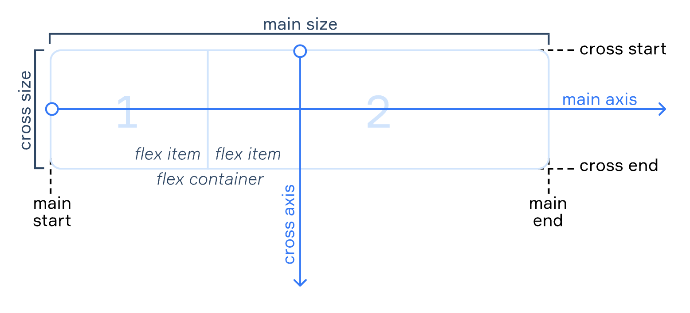

# The Styling Language
CSS uses selectors and a curly bracket as its basic syntax (declaration block). Basic styling:
```css
/* Select all elements */
* {
    color: black;
}

/* Select all elements of a specific type */
p { color: green; }

/* Class Selectors */
.just-her {
    color: purple;
}

/* ID Selectors */
#title { background-color: violet; }

/* Multiple Selectors */
.going, not-going { color: yellow; }
```

Chaining classes allows you to select only elements that has the same attributes: *.header.sub*. Ids and classes can also be chained like *.footer#section*. However, chaining cannot be used with type selectors.

Descendant combinator allows the child elements to be selected given that they have the same class attribute:
```css
.parent .child { color: orange; }
```
Advanced selectors:
- *child combinator* - >
- *adjacent sibling combinator* - +
- *general sibling combinator* - ~

CSS can be added to HTML:
```html
<link rel="stylesheet" href="styles.css">
```

## CSS Units
Absolute units are those that do not change with the most used being **px**. Relative units include *rem* and *em* for font size. The em element is based on the parent element, for instance if something is 10px: *4em = 40px*. The rem element is based on the root of the document and is recommended to use; allowing users to change is needed. Viewport units like vh and vw refer to the viewport where 1vh is equivalent to 1% of the viewport.
```css
/* Common relative units: relative to the parent element*/
p {
  height: 50%;
  font-size: 2.5em /* 2.5 times larger than the parent*/
  /* By default browsers font sizes are 16px*/
}
```

## Basic Properties
### Positioning
The default position is static. With absolute positioning, the other elements behave as though the element isn't there and shifts position. In other words, it does not affect the other elements on the screen. Relative is the same as static with the exception that the **top, bottom, right, and left** positions can be altered.
```css
.child {
  position: relative;
  left: 10px;
}
```
**Fixed** positioning stays the same even when scrolling as it does not reference a container element. **Sticky** is a combination of fixed and relative.
```css
.header {
  position: sticky;  
  top: 40px;    /* Define when the header becomes sticky */
  background-color: lightblue;
  width: 100%;
}
```
### Common Properties
#### The Box Model
Every element lays in a box which can be observed by using the *outline* property:
```css
* {
    outline: 2px solid red;
}
```
The box can be manipulated using:
- **padding**: the space between the border and the content
- **border**: space between the margin and the padding
- **margin**: space between adjacent borders
- **box-sizing**: has two attributes in content-box and border-box, where the first is the default.

Generally, the universal margin and padding is set to 0 and the box-sizing is set to border-box. The short-hand setting goes:
- top -> right -> bottom -> left
- auto can be used for horizontal centering

#### Block vs Inline
Block elements start on a new line while inline elements can be on the same line. Inline-block elements behave like inline but have some block properties:
```css
div {
    display: inline-block;
}
```

#### Colors in CSS
Color models are methods used for describing colors using quatitative characteristics. The **RGB** model uses different degrees of *red*, *green*, and *blue* to describe a color, using numbers in the range of **0-255**. The **HEX** hexidecimal system can denote the RGB where red can be *#FF0000*. **CMYK** is used for printing and it stands for *cyan, magenta, and yellow where the K is the degree of black*. 

Neutral colors like white and dark-gray are great to use. Using color palletes like [Coolors](https://coolors.co/palettes/trending) for accent colors can help with designing. However, don't forget to check compatibility and user accessibility on site like [ABC](https://abc.useallfive.com/).
Note: devote 10% ONLY to corporate color.

The **RGBA** color schemes add the alpha for transparency where 0 is complete transparency and 1 is opacity. **HSL** defines color by hue, saturation, and lightness. Hue is the angle on the color wheel and lightness and saturation are measured in percentages. **HSLA** adds transparency to HSL.

#### Background
The **background** property is used to set the background color or image of an element. The property **background-color** can have values like color, initial (default color), or inherit. The **background-image** property can have images using relative or absolute paths in the *url()* function or have a gradient using *linear-gradient()*.

The **background-repeat** property makes the image repeat and accept values like *repeat, no-repeat, and repeat-x | repeat-y*. The **background-attachment** takes the *scroll* and *fixed* values to allow the background to scroll with the content or stay in place. The **background-position** can take two values at a time where the first defines the horizontal axis and the second the vertical. The values can be in the form of units or top, left, right, bottom, and center. If one value is selected the second value would be centered. To change the size of the background use the property **background-size** with values as:
- *percentages*
- *contain*: height or width matches the viewport
- *cover*: height and width matches the viewport

The **background-clip** property determines the display area and have values like content-box, padding-box, and border-box. The **background** property can be used along for all the others but if not included the default properties would be used instead:
```css
div {
  background: url(image/cat.png) repeat contain;
}
```


#### Border
The **border-style** property can take values like inset, outset, dotted, dashed, solid, double, groove, and ridge. If the **border-color** is not specified it would take the color of the text of the element. The **border-width** sets the width. The **border** property allows all three properties to be set:
```css
button {
  /* width, style, color */
  border: 2px dotted gray;
}
```
Properties like the following allows you to set borders for one side of an element:
- *border-top, border-right, border-left, border-bottom*/

#### Overflow
Overflow properties include:
- *visible*
- *hidden*
- *scroll* - adds scroll bars even when it's not neccesary.
- *auto*

Notable: *text-overflow: ellipsis*, adds the dots. It should be used with the overflow property for text elements.

### Working With Text
The **text-align** property allows text to be aligned based on the border of the element. It can be aligned left, right, center, justify, start, or end.
```css
header {
  text-align: center;
}
```

## Selectors in Depth
### Pseudo-Classes
**Pseudo-Classes** allows you to work with the page in a dynamic mood. They must be attached to the selector in which they describe. Pseudo-classes that determine the *state of an element* responds to the current state selectors as they are. It has the syntax of:
```css
css-selector:pseudo-class {
  property: value;
}
```
Common classes are:
- **active**: time between pressing and releasing the mouse allowing the page to be active
- **focus**: focuses on an element
- **hover**: element reacts when the mouse is hovering
- **visited**: mark links that have already been visited

There are pseudo-classes that target the **DOM tree** to work with elements in an hierarchical order. Common classes include:
- **first-child, last-child**: target the first and last elements
- **nth-child(value)**:
    - nth-child(3): third child
    - nth-child(even/odd)
    - nth-child(3n): every third element, that is 3, 6, 9.

## Advance Displaying
### Flexbox
It is about arranging items into rows and columns, where they can shrink and grow. The full name is **Flexible Box Layout Module**.

- **Main-axis**: determines the default direction of elements
- **Cross-axis**: perpendicular to the main
- **Main start/end**: borders for the start and end
- **Cross start/end**
- **Main Size, Cross Size**: size of the axis

```css
.main-container {
    display: flex;  
}
```
Order and direction of flex container:
- **flex-direction**: determines the direction of the items in the container, with *row* being the default:
  - *Values*: row, row-reverse, column, column-reverse.
- **flex-wrap**: defines how the content may be in the container with consideration for overflow. It also releases the *align-content* property.
  - *Values*: nowrap, wrap, wrap-reverse.
- **flex-flow**: short-hand property for flex-direction and flex-wrap, where the direction value comes first:
  - Example: *flex-flow: row-reverse wrap*.

Order and direction of flex items:
- **order**: The values are placed in position based on a number with the default being 0.

Properties of flex:
- **flex-direction**: it is horizontal by default with a value of row, but can be changed to column
- **justify-content**: allows content to be aligned with space-around, space-between, center, and space-evenly
- **align-items**: positions items vertically using flex-start, center, flex-end, and baseline
- **flex-wrap**: can wrap cantents and releases the align-content property

Elements inside the main container can have specific properties:
- **flex-grow**
- **flex-shrink**
- **flex-basis**: overides the width
- **flex**: is the shorthand for all three
- **align-self**
- **order**: changes the order, where the last can appear first with -1

[Cheatsheet](https://flexbox.malven.co/)

### Grid
Grids are used for laying out elements. The elements of child containers are not a grid; but grid elements can be assigned grids. The **display** property can use *grid* or *inline-grid*. Implicit items can have their sizes specified with **grid-auto-rows/columns**. 
```css
section {
  display: grid;
  grid-template: 50px 50px / 50px 50px; /* columns are after */
  grid-auto-rows: 50px;
}
```
A gap can be added with the shorthand property of *gap* or *column/row-gap*.
Grid elements can be positioned with the following:
- *grid-column-start/end*: explicit
- *grid-column*: shorthand
- *grid-row-start/end*
- *grid-row*

The **grid-area** property can combine all these elements using slashes or texts.
```css
/* understanding grid-template-areas */
/* Only works with rectangles and squares */
.container {
  display: grid;
  grid-template-columns: repeat(4, 1fr);
  grid-template-rows: 200px 400px 400px 200px;
  grid-gap: 20px;
  grid-template-areas:
  /* Number of letters represent how many columns to span */
  'h h h h'
  'm m m a'
  'm m m s'
  'f f f f'
  ;
}

/* Initiate using the grid-area and the letter for each section */
header {
  grid-area: h;
}

main {
  grid-area: m;
}

section {
  grid-area: s;
}

aside {
  grid-area: a;
}

footer {
  grid-area: f;
}
```
The **resize** property allows the user to resize the container. The **overflow** property can be used to enable scrolling. The **repeat()** function allows multiple columns and rows to be created. The fractional unit **fr** allows dynamic creations as the space can be divided.
```css
/* Making grids more responsive */
div {
  grid-template-columns: repeat(5, clamp(150px, 20%, 200px));
}

div {
  grid-template-columns: repeat(5, minmax(150px, 200px));
}
```
If there is a width of 500px **auto-fit** can create equal sizes.
```css
section {
  display: grid;
  width: 500px;
  grid-template-columns: repeat(auto-fit, 100px);
  /* Constraints of minmax can also be used: repeat(auto-fit, minmax(100px, 1fr) */
  
}
```
### Floats
The **float** property allows you to have elements that can float around an element by moving it left or right. The element nor its parent that is needed to float can have its position set to absolute. The values of float are: *left, right, and inherit*. The proerty is used for block elements.

The **clear** property is a complement to the float property and has the values: left, right, both, and none. The property is used to allow elements inside a container that has a float property to go to the default flow.

## Fonts
You can choose fonts from external and internal sources, but always have a fallback font.
```html
<link rel="preconnect" href="https://fonts.googleapis.com">
<link rel="preconnect" href="https://fonts.gstatic.com" crossorigin>
<link href="https://fonts.googleapis.com/css2?family=Roboto&display=swap" rel="stylesheet">
```
They can also be imported at the top of the CSS file:
```css
@import url('https://fonts.googleapis.com/css2?family=Roboto&display=swap');

body {
  font-family: system-ui, "Segoe UI", Roboto, Helvetica, Arial, sans-serif, "Apple Color Emoji", "Segoe UI Emoji", "Segoe UI Symbol";
}
```
For fonts you have
```css
@font-face {
  font-family: my-cool-font;
  src: url(../fonts/the-font-file.woff);
}

h1 {
  font-family: my-cool-font, sans-serif;
}
```
Some text styles:
- text-overflow: such as ellipsis
- overflow: like hidden
- text-shadow
- text-transoform
- line-height
- line-spacing
- font-style

Let the browser determine the text size by using the **calc** function:
```css
font-size: calc(0.75rem * 1.5vw);

html {
    font-size: clamp(1rem, 0.75rem * 1.5vw, 2rem);
    max-inline-size: 45ch;
    line-height: 1.5;
}
```


### Functions
The **calc()** function is good for mixing units and nesting other calc() functions. The **max() and min()** functions can have calculations in them and selects the max or min value respectively. The **clamp()** function takes 3 values in the min, ideal, and max.
```css
p {
  /* The ideal is 4% of the viewport height */
  font-size: clamp(0.8rem, 4vh, 2rem);
  line-height: calc(1.2rem + 2vh);
}

img {
  width: min(50%, 300px);
}

header {
  grid-template-columns: minmax(400px, 2fr) 1fr /*The last is fixed */
}
```

**Custom properties** or CSS variables can be reused. To access them, use the **var()** function which accepts two parameters, the variable and a fallback value. The properties have can only be accessed by the scope in which it was created (element) and its descendants. The best way to use them is by declaring them on the root (:root) selector.


## Resources
- [Color Picker](https://colorpicker.dev/#bc36ecfa)
- [Grid Properties](https://css-tricks.com/snippets/css/complete-guide-grid/#top-of-site)
