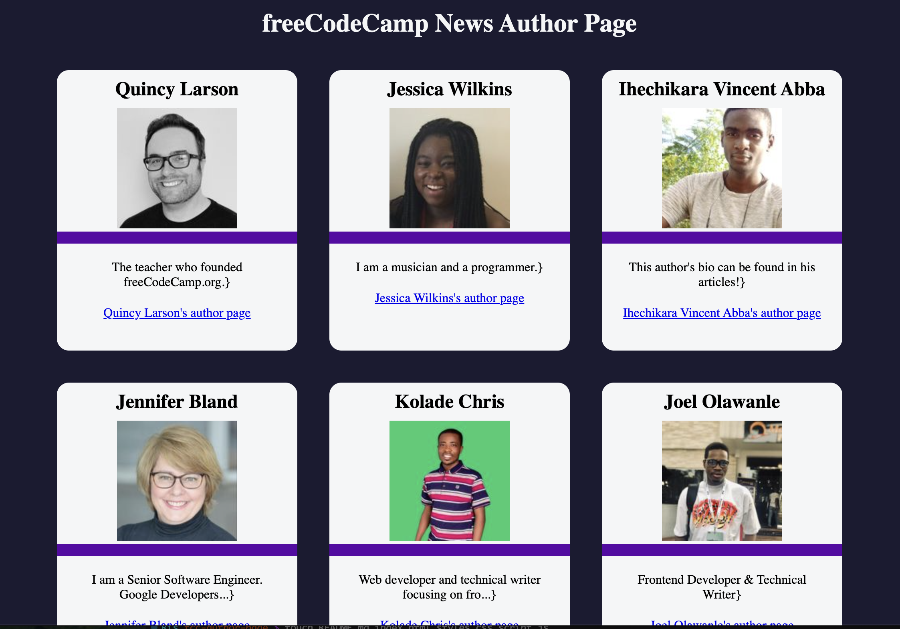

# freeCodeCamp News Author Page

The single page project displays the different authors of the coding website in cards that store there details. 

## Purpose
The main purpose for creating the web page was to practice making API calls in JavaScript. This was done through the *fetch()* method chained with two *then()* methods and a *catch()* to handle any errors.