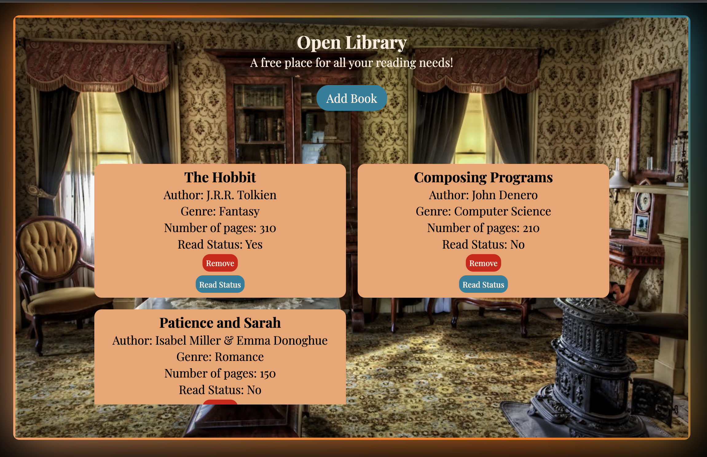

# Open Library
The Open Library project allows users to add and remove books from the library. Additionally, it shows information about the books such as the author and the number of pages it contains.

## Set up
The project was done using HTML, CSS, and JavaScript without any libraries or frameworks.

### Process
To begin the project a folder was created along with 3 files and an additional folder inside the initial folder.

The first file was an HTML file with three main elements inside the body:
- **div**: main container element
- **main**: used for the cards
- **dialog**: held the form to submit books

The CSS file was then populated with styling for the elements where functionalities like flex, grid, animate, and position were used to style to page.

The JavaScript file contained functions, eventListeners, and variables to add simple functionality. This enable the program to add and remove books from the library.

## Completed project

## Credit
1. Vintage Room: [Pixabay](https://www.pexels.com/photo/brown-chair-40504/)